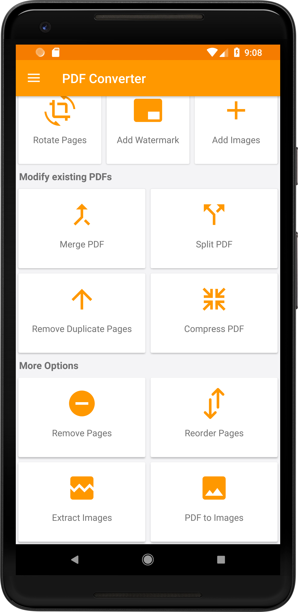
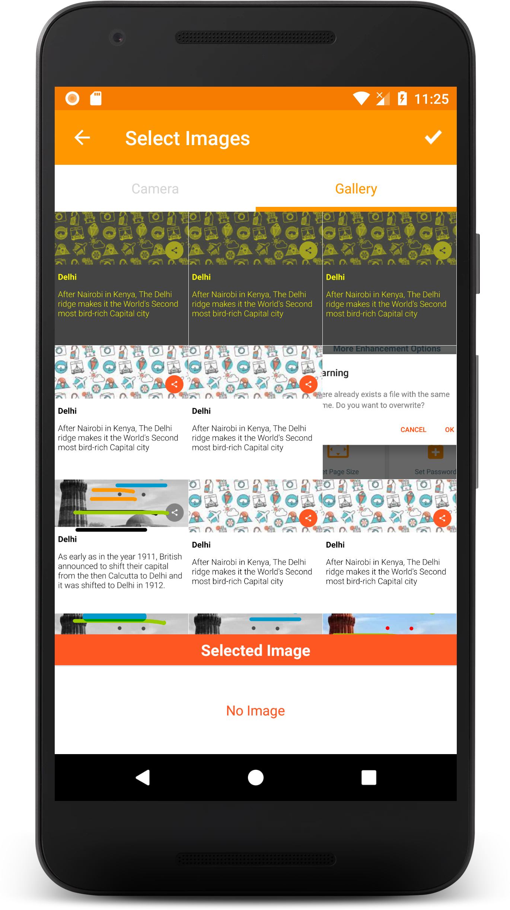
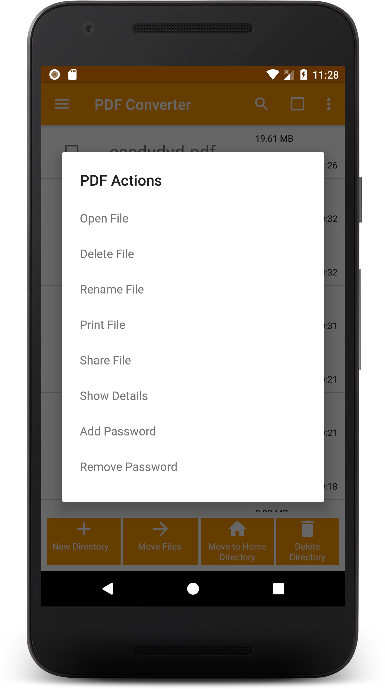
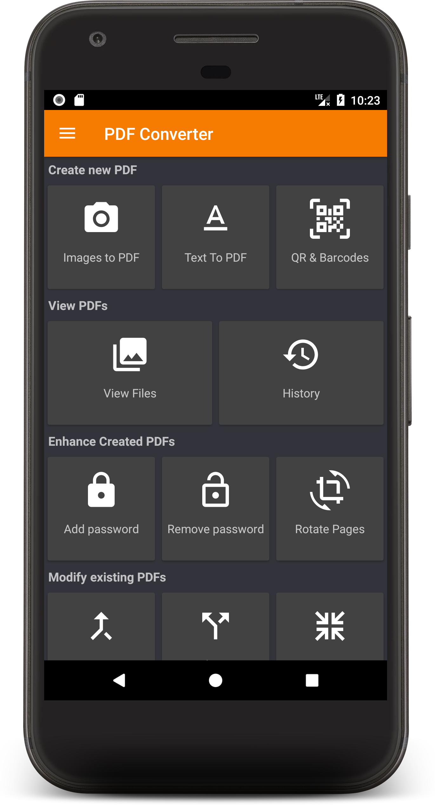
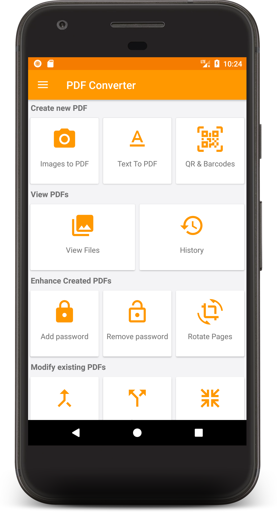

<!--
  ~ Copyright (C) 2014 The Android Open Source Project
  ~
  ~ Licensed under the Apache License, Version 2.0 (the "License");
  ~ you may not use this file except in compliance with the License.
  ~ You may obtain a copy of the License at
  ~
  ~   http://www.apache.org/licenses/LICENSE-2.0
  ~
  ~ Unless required by applicable law or agreed to in writing, software
  ~ distributed under the License is distributed on an "AS IS" BASIS,
  ~ WITHOUT WARRANTIES OR CONDITIONS OF ANY KIND, either express or implied.
  ~ See the License for the specific language governing permissions and
  ~ limitations under the License.
-->this app update
userinterface 
about
minner error 

# Smart Pdf Editor

# My Paid App

This app is a modified version of [https://github.com/AnkitSingh987/Smart-Pdf-Editor) originally created by ANkitSingh987.

## License

This app is licensed under the GNU General Public License v3.0. See the[./LICENSE](https://github.com/AnkitSingh987/Smart-Pdf-Editor/blob/my-new-branch/LICENSE.md)) file for details.

## Source Code

The source code for this app is available at: [[Your Repository Link or Website](https://github.com/AnkitSingh987/Smart-Pdf-Editor/tree/my-new-branch)]

## Modifications

This app contains modifications from the original project. For a list of changes, see the [CHANGELOG](./CHANGELOG.md).

### 3. Source Code Availability

https://github.com/AnkitSingh987/Smart-Pdf-Editor/tree/my-new-branch

### 4. License Notice in Code Files

(https://github.com/AnkitSingh987/Smart-Pdf-Editor/blob/my-new-branch/LICENSE.md)

Example code comment:
python
# This file is part of My Paid App
# 
# My Paid App is based on smart pdf editor originally created by ankitsingh987.
# This project is licensed under the GNU General Public License v3.0.

## License
This project is licensed under the GPL 3.0 License - see the [LICENSE]((https://github.com/AnkitSingh987/Smart-Pdf-Editor/blob/my-new-branch/LICENSE.md)) file for details.

### 5. Distribute the License

Aapko ensure karna hoga ki aap apne app ke saath GPL-3.0 license ko distribute karein. Agar aap app stores jaise Google Play Store ya Apple App Store pe distribute kar rahe hain, toh aapko license ka text aur source code ke link ko clearly mention karna hoga.

### 6. Disclose Modifications

applicationId "ankitsingh.smartpdfeditor"

Ankit_singh

### Badges

https://play.google.com/store/apps/details?id=ankitsingh.smartpdfeditor

Have JPG when you need a PDF? Convert JPG to PDF in a few seconds! :smiley:  
Here is an easy to use Android app to convert images to PDF file!

### Support Us
download app
https://play.google.com/store/apps/details?id=ankitsingh.smartpdfeditor

### Features

- Create PDF from multiple images from camera or gallery
- View your converted PDFs
  - Open, Rename, Delete, print, share files
  - Sort the files order based on a number of options
  - View File details
  - Encrypt PDF
  - Decrypt PDF
  - Rotate Pages
- Different themes
- Merge existing PDFs
- Split existing PDFs
- Convert text file to PDFs
- Compress existing PDF
- Remove pages from a PDF
- Rearrange pages of a PDF
- Extract images from PDF
- History : View all the PDF related conversions

Here is a home page to get quick access to all the features "PDF Converter" provides:

 

### Creating a PDF file

##### Step 1 : User can view the PDF files previously created or create a new one!

##### Step 2 : Select the images

 

##### Step 3 : Name the PDF file

##### Step 4 : Creating PDF

Hurray! PDF files of selected images are created.

### Viewing the PDF files

 

### Different themes

Go to Settings, and you can have three type of themes : Black, Dark and White

| Black                                                        | Dark                                                        | White                                                        |
|--------------------------------------------------------------|-------------------------------------------------------------|--------------------------------------------------------------|
|  |  |  |

### Merge PDF

### Text to PDF

### History

### Contributing

#### Dependencies

+ [Butterknife](https://jakewharton.github.io/butterknife/)
+ [Folderpicker](https://github.com/kashifo/android-folder-picker-library)
+ [Image-cropper](https://github.com/ArthurHub/Android-Image-Cropper)
+ [iTextG](http://developers.itextpdf.com/itextg-android)
+ [Lottie](https://github.com/airbnb/lottie-android)
+ [Matisse](https://github.com/zhihu/Matisse)
+ [Material Dialogs](https://github.com/afollestad/material-dialogs)
+ [Material Ripple](https://github.com/balysv/material-ripple)
+ [Morphing Button](https://github.com/dmytrodanylyk/android-morphing-button)
+ [Picasso](http://square.github.io/picasso/)
+ [Picasso-transformations](https://github.com/wasabeef/picasso-transformations)
+ [PhotoEditor](https://github.com/burhanrashid52/PhotoEditor)
+ [viewpager-transformers](https://github.com/geftimov/android-viewpager-transformers)
+ [zxing](https://github.com/zxing/zxing)

#### Code & Issues

If you are a developer and you wish to contribute to the app please fork the project
and submit a pull request.
Follow [) for collaboration!
If you have any questions, feel free to ask [me](mailto:Ankitkumarravi84060@gmail.com) about whatever you
want.
[Here]() is the list of known issues.

### Project Maintainers

This project is founded and actively maintained by . For
any sort of queries feel free to mail at Ankitkumarravi84060@gmail.com.

Acknowledgements
credit
[Swati Garg](https://github.com/Swati4star/) 
https://github.com/Swati4star/Images-to-PDF
Thank you
This project is a fork of the original Images-to-PDF created by Swati Garg. We greatly appreciate the original work and inspiration.

